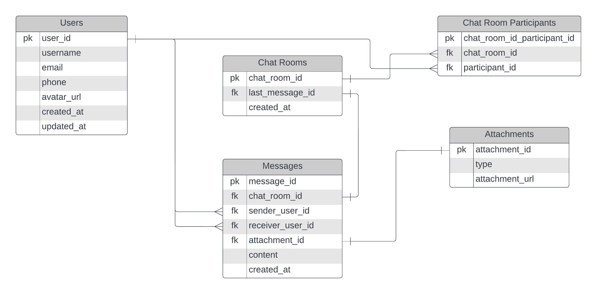
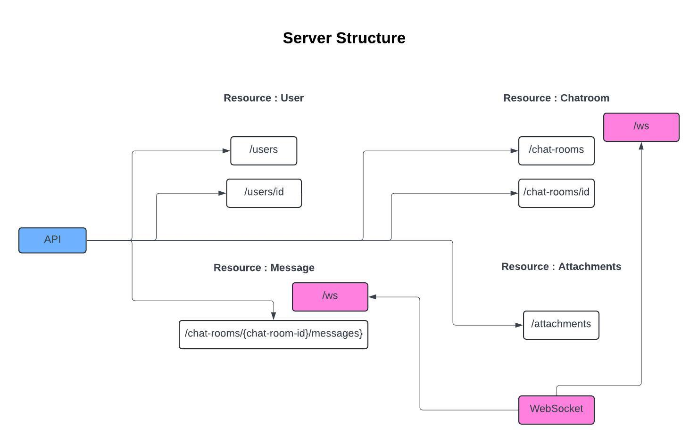
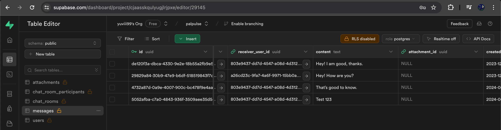

# PalPulse

A flutter based chat application built with supabase

## Technologies

- **Application**: Flutter, Dart
- **Backend**: Supabase

## Data Model

## Server Structure

## Application Screenshot

## Database Screenshot

The message sent in the app is updated in the supabase.

